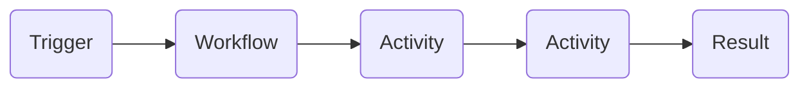

# RCMbox

RCMbox is a headless billing backend for healthcare product teams. It gives you modular, reusable building blocks for billing workflows — configurable to any care model, self-hosted in your own infrastructure, and FHIR-native throughout.

## What you get

- **Workflows** — YAML-defined activity trees that run durably on Temporal. Use pre-built templates for claims, ERAs, and remittances, customize any step, or build from scratch with full TypeScript control.
- **Activities** — a growing library of built-in building blocks: FHIR operations, X12 parsers and builders, EHR integrations (Athena, Cerner), and RCM-specific logic. Extend with your own TypeScript activities at any point.
- **Validation rules** — configurable claim validation with error, warning, and information severity levels. Every rule is transparent, auditable, and extensible.
- **Triggers** — start workflows automatically from FHIR resource changes or on a cron/interval schedule.
- **AI agent** — describe your billing logic in plain English; the agent writes TypeScript code and wires it into your workflows.

## How it works

Every process is a **workflow** — a YAML file describing a tree of activities. Each activity is a TypeScript function, either built-in or written by your team. Workflows run on [Temporal](architecture/temporal.md), which provides retries, full execution history, and deduplication.

All client-specific logic lives in a **config project** — a git repository with workflow YAMLs, project-specific activities, validation rules, and triggers. Each client gets their own branch. The engine loads the right branch at runtime.

## What's next


[Getting Started](getting-started/overview.md)

