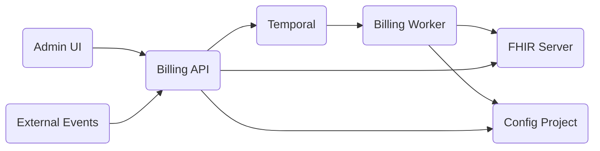

# System Architecture

RCMbox consists of four services that work together to execute billing workflows.

## Services

| Service | Role |
|---|---|
| **FHIR Server** | Stores all clinical and billing data. RCMbox ships with [Aidbox](aidbox.md) by default, but any FHIR-compliant server can be used. |
| **Temporal** | Workflow engine — executes workflows durably with retries and history |
| **Billing API** | HTTP server — triggers workflows, manages the config repo, serves the admin UI |
| **Billing Worker** | Temporal worker — loads workflow YAMLs, executes activity scripts |

## Data flow

1. An event arrives at the Billing API — a trigger webhook, a schedule, or a manual UI call.
2. The API creates a Temporal workflow on the `billing` task queue.
3. The Billing Worker picks up the workflow and creates a `BillingWorkflow` tracking resource in the FHIR server.
4. The worker loads the workflow YAML from the config project directory (resolved by branch).
5. For each activity: resolve params → import the TypeScript script → call `main(params)` → store output.
6. Activities read and write FHIR resources via the FHIR REST API.
7. On completion, the worker patches the `BillingWorkflow` status to `completed` or `failed`.
8. The UI polls `GET /workflows/:id/runs/:runId` — the API reads Temporal history and returns live status.

## Deployment

The API and Worker run as separate Docker containers sharing two volumes:

- `/data/repo` — the main branch of the config project (cloned on startup)
- `/data/worktrees` — git worktrees for non-main branches
- `/data/checkouts` — commit-specific checkouts used when `DYNAMIC_RELOAD=true`

Both containers require access to the FHIR server and Temporal.


[Aidbox (FHIR Server)](aidbox.md)



[Temporal (Workflow Engine)](temporal.md)



[Billing API](billing-api.md)



[Billing Worker](billing-worker.md)

