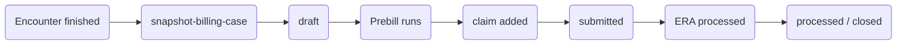

# BillingCase

`BillingCase` is a custom FHIR resource that tracks the full billing lifecycle for a single encounter. It is the central record that links all billing artifacts — charge items, claims, and claim responses — back to the clinical encounter.

## Purpose

When a billing workflow starts for an encounter, the first step is always `snapshot-billing-case`. This activity creates a `BillingCase` and embeds a snapshot of all relevant clinical and demographic data as **contained resources**. The snapshot normalizes data from different EHR sources into a standard structure and ensures that billing calculations are not affected by later changes to the source records.

## Structure

```json
{
  "resourceType": "BillingCase",
  "id": "bc-001",
  "status": "draft",
  "snapshotDate": "2024-01-15T10:30:00Z",
  "patient": { "reference": "Patient/pat-1", "extension": [{ "valueReference": { "reference": "#pat-1" } }] },
  "encounter": [{ "reference": "Encounter/enc-1" }],
  "coverage": [{ "reference": "Coverage/cov-1" }],
  "procedure": [{ "reference": "Procedure/proc-1" }, { "reference": "Procedure/proc-2" }],
  "chargeItem": [{ "reference": "ChargeItem/bc-001-ci-0" }],
  "claim": [{ "reference": "Claim/claim-001" }],
  "claimResponse": [{ "reference": "ClaimResponse/cr-001" }],
  "contained": [
    { "resourceType": "Patient", "id": "pat-1", ... },
    { "resourceType": "Encounter", "id": "enc-1", ... },
    { "resourceType": "Coverage", "id": "cov-1", ... }
  ]
}
```

## Key fields

| Field | Description |
|---|---|
| `status` | `draft`, `submitted`, `processed`, or `closed` |
| `snapshotDate` | When the clinical data was snapshotted |
| `patient` | Dual reference — external ref (`Patient/id`) and contained ref (`#id`) |
| `encounter` | List of encounter references (usually one) |
| `coverage` | Coverage resources used for billing |
| `procedure` | Procedures included in this billing case |
| `practitioner` | Practitioners associated with the procedures |
| `organization` | Organizations (service provider, payer) |
| `chargeItem` | ChargeItems generated during prebill |
| `claim` | Claims generated from this case |
| `claimResponse` | ClaimResponses linked back to the claims |
| `contained` | Full snapshots of all referenced resources |

## Idempotency

`snapshot-billing-case` is idempotent — if a `BillingCase` already exists for an encounter, it returns the existing one. This means re-running prebill for the same encounter is safe and will not create duplicate records.

## Lifecycle



## See also


[snapshot-billing-case](../reference/activities/snapshot-billing-case.md)



[fetch-context](../reference/activities/fetch-context.md)

