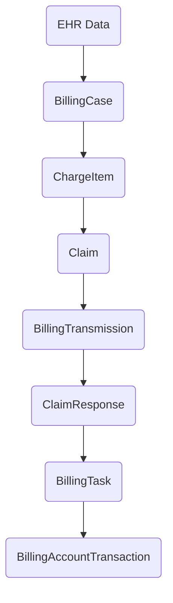

# FHIR Data Model

RCMbox is FHIR-native — all data is stored and exchanged as FHIR resources. The data model combines standard FHIR resources with custom resources that cover billing concepts FHIR does not model out of the box.

## Billing lifecycle

Resources are created and linked as a claim moves through the billing cycle:

Green = standard FHIR resources. Blue = custom resources.

1. **EHR data arrives** — Patient, Encounter, Procedures, Coverage are synced from the EHR as standard FHIR resources.
2. **BillingCase** is created — snapshots clinical data and tracks the full billing lifecycle for the encounter.
3. **ChargeItems** are resolved — procedures are matched to ChargeItemDefinitions to produce billable line items.
4. **Claim** is built — a draft FHIR Claim with a Patient Control Number (PCN), ready for submission.
5. **BillingTransmission** wraps the X12 file — the Claim is mapped to 837P and transmitted to the payer.
6. **ClaimResponse** is created — when an 835 ERA or 277 status file arrives, it is parsed and mapped to ClaimResponse resources, then linked back to the original Claim via PCN.
7. **BillingTasks** are generated — adjudication rules create tasks for items that need manual action (write-offs, transfers, denials).
8. **BillingAccountTransactions** record financial outcomes — payments, adjustments, and transfers are posted to the billing ledger.

## Standard FHIR resources

These are standard FHIR R4 resources used as-is:

| Resource | Role in RCMbox |
|---|---|
| Coverage | Patient insurance information, sourced from the EHR |
| ChargeItem | Individual billable line item for a procedure |
| ChargeItemDefinition | Rules that define how procedures map to charges |
| Claim | Formal billing claim submitted to a payer |
| ClaimResponse | Payer's adjudication result (from 835 ERA or 277 status) |

## Custom resources

These are custom resource types defined via Aidbox StructureDefinitions. They extend the FHIR model to cover billing-specific concepts:

| Resource | Role in RCMbox |
|---|---|
| [BillingCase](billing-case.md) | Central record linking an encounter to all its billing artifacts |
| [BillingTransmission](billing-transmission.md) | A batch of claims or responses transmitted as an X12 file |
| [BillingTask](billing-task.md) | A unit of work requiring action (e.g., write-off, denial review) |
| [BillingAccountTransaction](billing-account-transaction.md) | A financial transaction — payment, adjustment, or transfer |