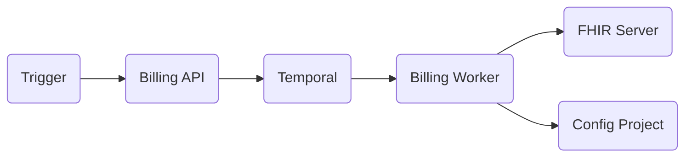

# Key Concepts

RCMbox has five core concepts. Everything else builds on these.

## Workflow

A **workflow** is a YAML file that defines a process as a tree of activities. Each workflow has an `id`, an `input` schema, and an `activities` list that tells the engine what to run and in what order.

Workflows are stored in the [config project](../config-project/overview.md) under `workflows/`. The engine that executes them runs on [Temporal](../architecture/temporal.md), which provides durable execution — retries, history, and deduplication come for free.

## Activity

An **activity** is a TypeScript file that does one thing. It exports a `main(input)` function and a `description` markdown string. The workflow engine calls `main` with the parameters defined in the workflow YAML and stores the output so downstream activities can reference it.

Activities are either **built-in** (shipped with the worker image) or **project-specific** (written by the client's team and stored in the config project). Built-in activities are referenced in YAML with the `@aidbox-billing/` prefix; project-specific activities use a relative file path.

## Config Project

The **config project** is a separate git repository that contains everything client-specific: workflow YAMLs, project-specific activity scripts, validation rules, and triggers. Each client gets their own config project.

Within a config project, different environments or feature streams use **branches** — each branch can have its own version of workflows and activities. The running worker picks up the correct branch automatically. The running worker picks up the correct branch automatically.

## Trigger

A **trigger** automatically starts a workflow in response to an external event. There are two kinds:

- **Subscription trigger** — fires when a FHIR resource changes (e.g., an Encounter reaches `finished` status). Uses the FHIR server's topic-based subscription system.
- **Schedule trigger** — fires on a cron/interval schedule via Temporal's native scheduler.

Triggers live in the config project under `triggers/`.

## Temporal

**Temporal** is the workflow execution engine underneath RCMbox. It handles the hard parts of distributed execution: retries on failure, full execution history, and workflow-ID-based deduplication. You don't interact with Temporal directly — the billing API and worker do that for you — but its guarantees are what make workflows reliable.

---

## How they fit together

1. A trigger (or a manual API call) tells the Billing API to start a workflow.
2. The API schedules a Temporal workflow on the `billing` task queue.
3. The Billing Worker picks it up, loads the workflow YAML from the config project, and executes each activity in order.
4. Activities read and write data — FHIR resources, external APIs, or anything else their logic requires.


[System Architecture](../architecture/overview.md)

