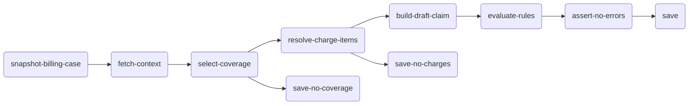

# Activity Tree Structure

Workflows are modeled as a tree of activities. The tree structure determines execution order and which outputs are available to which activities.

## Basic structure

Every workflow has a `rootChildren` list — the first activities to execute. Each activity declares its `children`, which run after it completes. The engine walks this tree depth-first.



## Sequential execution

Within a single branch, activities run one after another. Each activity can reference the outputs of all its ancestors.

```yaml
rootChildren: [step-a]

activities:
  - id: step-a
    children: [step-b]
  - id: step-b
    children: [step-c]
  - id: step-c
```

## Parallel branches

When an activity has multiple children, those children run as independent branches. Each branch is unaware of the other's outputs.

```yaml
- id: select-coverage
  children: [resolve-charge-items, save-no-coverage]
```

Both `resolve-charge-items` and `save-no-coverage` start after `select-coverage` completes. They run in parallel and can only reference their own ancestors, not each other.


[Conditional Execution](conditional-execution.md)


## Parent-child data flow

Data flows down the tree — from parent to child — through `params`. A child can reference any ancestor's output, but not siblings.

```yaml
- id: fetch-context                   # parent
  children: [build-claim]

- id: build-claim                     # child — can reference fetch-context
  params:
    context: $activities.fetch-context.output
```


[Parameter Resolution](parameter-resolution.md)


## Leaf activities

Activities with no `children` are leaf nodes — they complete their branch of the workflow. Each conditional branch should terminate with its own leaf (usually a save/finalize activity). There is no explicit merge point.

## rootChildren with multiple entries

You can have multiple root activities that run in parallel from the start:

```yaml
rootChildren: [fetch-patient, fetch-payer]

activities:
  - id: fetch-patient
    ...
  - id: fetch-payer
    ...
```

Both start immediately when the workflow begins. This is rare — most billing workflows have a single root.
