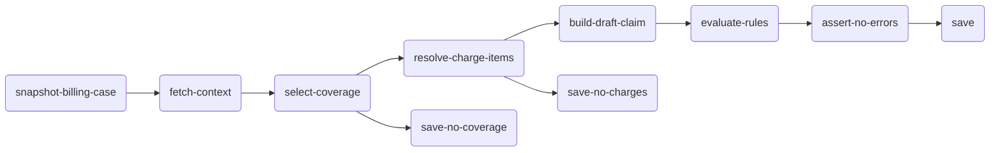

# Prebill

Creates a billing case, resolves charge items, builds a draft claim, and runs validation rules. Typically triggered when an encounter reaches `finished` status. Idempotent — safe to re-run (deletes old planned/draft resources before creating new ones).

## Input

| Field | Type | Description |
|---|---|---|
| `encounterId` | string | FHIR Encounter resource ID |
| `tenantOrganizationId` | string | Tenant Organization ID for FHIR scoping |
| `submissionType` | string | `"original"` \| `"replacement"` \| `"void"` (default: `"original"`) |
| `replacesClaimId` | string | ID of the previous Claim being replaced or voided |
| `coverageId` | string | Explicit Coverage ID override (for resubmissions) |

## Activity tree

Blue = built-in activities. Grey = project-specific activities.

## Activities

### 1. snapshot-billing-case _(built-in)_

Finds or creates a `BillingCase` for the encounter. On first run, snapshots all clinical resources (Patient, Encounter, Procedures, Coverages, Practitioners, Organizations) as contained resources. Idempotent — returns the existing BillingCase if one already exists.

**Output:** `billingCaseId`, `created`

### 2. fetch-context _(built-in)_

Loads the full `BillingCaseContext` from the BillingCase: patient, encounter, procedures, practitioners, coverages, organizations, conditions, and any previously created claims/charge items.

**Output:** `BillingCaseContext` object

### 3. select-coverage _(project-specific)_

Picks the coverage to bill against. The selection strategy is client-specific — typically prefers the coverage with `order: 1` and `status: active`. Accepts an optional `coverageId` override for resubmissions.

**Output:** `coverage`, `selectionReason`, `hasCoverage`, `noCoverage`

### 4a. resolve-charge-items _(project-specific, conditional)_

_Runs only when `select-coverage.hasCoverage` is truthy._

Fetches `ChargeItemDefinition` resources, evaluates applicability, and creates planned `ChargeItem` resources for each matched (procedure, definition) pair. Handles deletion of stale charge items from previous runs.

**Output:** `chargeItems`, `chargeItemDefinitions`, `bundle`, `hasChargeItems`, `noChargeItems`

### 4b. save-no-coverage _(project-specific, conditional)_

_Runs only when `select-coverage.noCoverage` is truthy._

Persists the BillingCase with a `no-coverage` status. Terminates this branch.

### 5a. build-draft-claim _(built-in, conditional)_

_Runs only when `resolve-charge-items.hasChargeItems` is truthy._

Assembles a FHIR `Claim` in draft status from charge items, ChargeItemDefinition pricing, and the BillingCaseContext. Generates a Patient Control Number (PCN) identifier. Embeds clinical context as contained resources.

**Output:** `context` (augmented with chargeItems), `claim`, `bundle`

### 5b. save-no-charges _(project-specific, conditional)_

_Runs only when `resolve-charge-items.noChargeItems` is truthy._

Persists the BillingCase with a `no-charges` status. Terminates this branch.

### 6. evaluate-rules _(built-in)_

Reads `validation-rules/manifest.yaml`, runs each rule against the BillingCaseContext, and returns `BillingTask` resources for failed rules. Does not persist anything — tasks are saved downstream.

**Output:** `taskBundle`, `passed`, `summary`, `assignedDashboard`, `assignedWorklist`

### 7. assert-no-errors _(project-specific)_

Checks whether `evaluate-rules.passed` is true. If errors were found, records the error summary on the BillingCase but does not fail the workflow — claim submission will be blocked until errors are resolved via the billing worklist.

**Output:** `blocked`, `summary`

### 8. save _(project-specific)_

Persists all resources to Aidbox in a single FHIR transaction: charge items, draft claim, BillingCase update, and BillingTask records. Updates the BillingCase status.

**Output:** `billingCaseId`, `claimId`, `chargeItemsCount`, `status`

## Outcomes

On successful completion (with coverage and charge items):
- A `BillingCase` resource linked to the encounter exists in Aidbox.
- `ChargeItem` resources for each matched procedure.
- A `Claim` in `draft` status with a PCN, ready for the Claim Submission workflow.
- `BillingTask` resources for any validation warnings or errors.

## Common issues

| Issue | Cause | Fix |
|---|---|---|
| No charge items built | No completed procedures, or no matching `ChargeItemDefinition` | Add procedure codes to the encounter and verify ChargeItemDefinitions exist |
| Validation failed — missing NPI | Practitioner has no NPI identifier | Add `http://hl7.org/fhir/sid/us-npi` identifier to the Practitioner |
| Validation failed — no active coverage | Coverage `status` is not `active` or period has expired | Update coverage or provide a `coverageId` override |
| select-coverage returns no coverage | No `Coverage` resource linked to the patient | Create a `Coverage` resource linked to the patient |

## See also


[snapshot-billing-case](../reference/activities/snapshot-billing-case.md)



[build-draft-claim](../reference/activities/build-draft-claim.md)



[evaluate-validation-rules](../reference/activities/evaluate-validation-rules.md)

